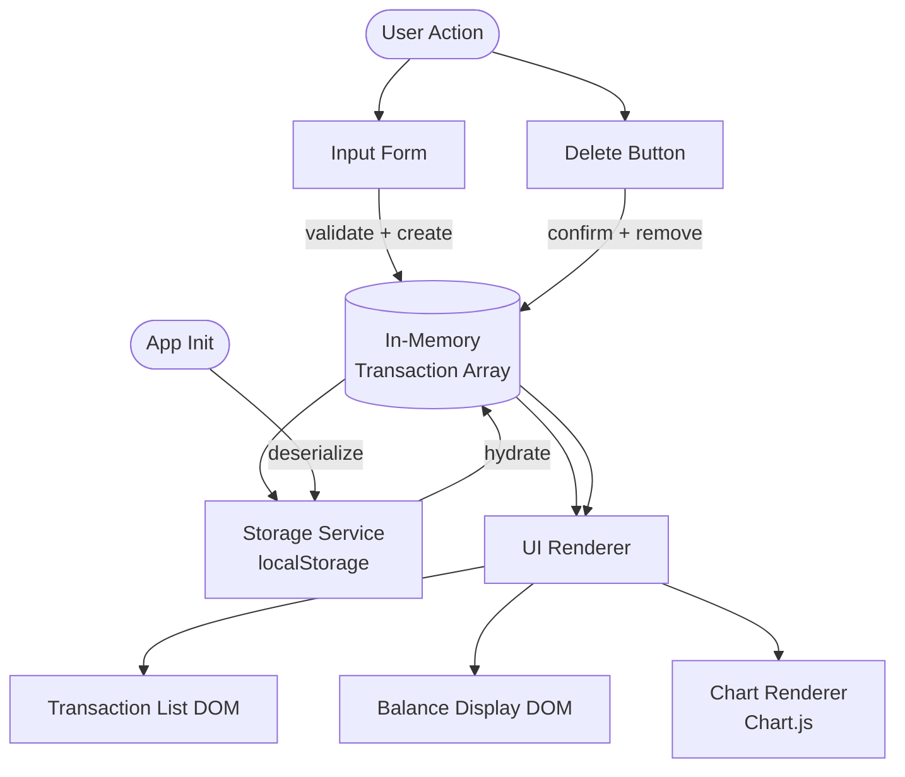

# Design Document

## Overview

The Expense Tracker is a single-page, client-side web application that lets a user record, review, and visualize personal expenses. It runs entirely in the browser with no server, no framework, and no build step. All data is stored in the browser's `localStorage` API. The chart is rendered by [Chart.js v4](https://www.chartjs.org/) loaded from a CDN.

The application consists of exactly three files:

```
index.html         ← single HTML entry point
css/style.css      ← all visual styling
js/app.js          ← all application logic
```

The JavaScript module follows a **controller/service** split inside a single file: pure data-manipulation functions sit at the top (easily unit-testable), and DOM-touching functions are grouped below them.

---

## Architecture

The app uses a unidirectional data-flow pattern:



**Key design decisions:**

1. **Single source of truth** — the in-memory `transactions` array is the authoritative state. DOM and localStorage are always derived from it.
2. **Write-before-render** — `localStorage` is updated synchronously before the DOM is re-rendered after every mutation, satisfying Requirement 6 (persistence before UI update).
3. **Full re-render on mutation** — after any add or delete, the entire Transaction List, Balance Display, and Chart are re-rendered from the current array. This is safe and simple for the expected data volume (personal expenses).
4. **Chart.js instance lifecycle** — a single `Chart` instance is created on first render. On subsequent renders, `chart.data` is mutated in-place and `chart.update()` is called. If the canvas is hidden/shown (empty-state toggle), the instance is destroyed and recreated.

---

## Components and Interfaces

### 1. `StorageService`

Encapsulates all `localStorage` interactions.

```
StorageService.load()   → Transaction[]   // deserialize; returns [] on failure
StorageService.save(transactions: Transaction[]) → void  // serialize; shows error on failure
```

- Uses the key `"expense_tracker_transactions"`.
- `JSON.parse` is wrapped in `try/catch`; on any error it logs the error and returns `[]`.
- `JSON.stringify` is wrapped in `try/catch`; on failure a non-blocking notification is displayed and the in-memory state is preserved.

### 2. `Validator`

Pure functions with no DOM side-effects.

```
Validator.validateForm(name: string, amount: string, category: string)
  → { valid: boolean, errors: { name?: string, amount?: string, category?: string } }
```

- `name`: must be non-empty after trimming whitespace; maximum 100 characters.
- `amount`: must parse as a finite number; must be within `[0.01, 999_999_999.99]` inclusive.
- `category`: must be one of `"Food"`, `"Transport"`, `"Fun"`.

### 3. `TransactionService`

Pure functions that operate on the transaction array.

```
TransactionService.create(name, amount, category) → Transaction
TransactionService.remove(transactions, id)        → Transaction[]
TransactionService.sortByDate(transactions)        → Transaction[]  // descending
TransactionService.calcBalance(transactions)       → number
TransactionService.calcCategoryTotals(transactions)
  → { Food: number, Transport: number, Fun: number }
TransactionService.roundAmount(value: number)      → number   // half-up to 2 dp
```

### 4. `UIRenderer`

Functions that write to the DOM. Each is called with a snapshot of the current state; none read from the DOM.

```
UIRenderer.renderTransactionList(transactions: Transaction[]) → void
UIRenderer.renderBalance(total: number)                       → void
UIRenderer.renderChart(categoryTotals: CategoryTotals)        → void
UIRenderer.showFormErrors(errors: object)                     → void
UIRenderer.clearFormErrors()                                  → void
UIRenderer.resetForm()                                        → void
UIRenderer.showNotification(message: string)                  → void
```

### 5. Event Handlers (top-level in `app.js`)

```
handleFormSubmit(event)  // validates → creates → saves → re-renders
handleDeleteClick(event) // confirms → removes → saves → re-renders
```

### 6. `init()`

Runs on `DOMContentLoaded`. Loads from storage, hydrates the in-memory array, calls all three render functions, attaches event listeners.

---

## Data Models

### Transaction

```js
{
  id:        string,   // crypto.randomUUID() or Date.now().toString() fallback
  name:      string,   // trimmed, max 100 chars
  amount:    number,   // positive float, rounded to 2 dp (half-up)
  category:  "Food" | "Transport" | "Fun",
  createdAt: string    // ISO 8601 timestamp, e.g. "2025-04-01T10:30:00.000Z"
}
```

### CategoryTotals

```js
{
  Food:      number,   // sum of all Food transaction amounts
  Transport: number,
  Fun:       number
}
```

### ValidationResult

```js
{
  valid:  boolean,
  errors: {
    name?:     string,  // human-readable error description
    amount?:   string,
    category?: string
  }
}
```

### StorageState

The value stored under the key `"expense_tracker_transactions"` in `localStorage` is a JSON-serialized `Transaction[]` array.

```json
[
  {
    "id": "1711967400000",
    "name": "Lunch",
    "amount": 12.50,
    "category": "Food",
    "createdAt": "2024-04-01T10:30:00.000Z"
  }
]
```

---

## Correctness Properties

*A property is a characteristic or behavior that should hold true across all valid executions of a system — essentially, a formal statement about what the system should do. Properties serve as the bridge between human-readable specifications and machine-verifiable correctness guarantees.*

### Property 1: Form submission with valid inputs always grows the transaction list

*For any* transaction list and any valid input (non-empty name ≤ 100 chars, amount in [0.01, 999,999,999.99], valid category), submitting the form SHALL add exactly one new Transaction and the list length SHALL increase by exactly 1.

**Validates: Requirements 1.3**

---

### Property 2: Whitespace-only and out-of-range inputs are always rejected

*For any* input where the name is composed entirely of whitespace characters, or the amount is outside [0.01, 999,999,999.99], or no category is selected, form submission SHALL not create a Transaction and the transaction list SHALL remain unchanged.

**Validates: Requirements 1.4, 1.5**

---

### Property 3: Transaction serialization round-trip

*For any* array of Transactions, serializing it to JSON (via `JSON.stringify`) and then deserializing it (via `JSON.parse`) SHALL produce an array that is structurally equal to the original — i.e., every field of every Transaction is preserved.

**Validates: Requirements 6.1, 6.2, 6.3**

---

### Property 4: Balance equals the sum of all transaction amounts

*For any* transaction list, the value returned by `calcBalance` SHALL equal the arithmetic sum of all `amount` fields in the list, rounded to 2 decimal places.

**Validates: Requirements 4.1, 4.2, 4.3**

---

### Property 5: Category totals partition the balance

*For any* non-empty transaction list, the sum of all values in `CategoryTotals` (Food + Transport + Fun) SHALL equal the total balance returned by `calcBalance`.

**Validates: Requirements 5.1**

---

### Property 6: Amount rounding is idempotent

*For any* numeric amount, applying `roundAmount` twice SHALL produce the same result as applying it once: `roundAmount(roundAmount(x)) === roundAmount(x)`.

**Validates: Requirements 4.6**

---

### Property 7: Deletion preserves all other transactions

*For any* transaction list and any valid transaction ID present in the list, calling `remove(transactions, id)` SHALL return a new array that contains every transaction from the original list except the one with that ID, in the same relative order.

**Validates: Requirements 3.3**

---

### Property 8: Transaction list is always sorted descending by date

*For any* transaction list, `sortByDate(transactions)` SHALL return an array where for every adjacent pair `[a, b]`, `a.createdAt >= b.createdAt`.

**Validates: Requirements 2.1**

---

## Error Handling

| Scenario | Detection | Response |
|---|---|---|
| Empty / whitespace name | `Validator.validateForm` | Inline error under the name field; no transaction created |
| Amount out of range or non-numeric | `Validator.validateForm` | Inline error under the amount field; no transaction created |
| No category selected | `Validator.validateForm` | Inline error under the category field; no transaction created |
| `localStorage` read failure on init | `try/catch` around `JSON.parse` | App initializes with empty state; non-blocking toast notification |
| `localStorage` write failure on mutation | `try/catch` around `JSON.stringify` / `setItem` | Non-blocking toast notification; in-memory state retained for session |
| Transaction entry missing fields | Guard in `UIRenderer.renderTransactionList` | Entry rendered with "N/A" for missing fields; app does not crash |
| `calcBalance` produces `NaN` / `Infinity` | Guard in `UIRenderer.renderBalance` | Balance Display shows `--` error indicator instead of a numeric value |
| Unhandled JS runtime error | `window.onerror` global handler | Toast notification shown; page is not reloaded |

**Non-blocking notification pattern:** A `<div id="notification">` element is positioned fixed at the bottom of the viewport. It becomes visible for 4 seconds then auto-hides. It does not block user interaction.

---

## Testing Strategy

### Unit Tests (Jest or similar)

Unit tests target pure functions only — no DOM, no `localStorage`, no Chart.js.

**`Validator`**
- Valid inputs pass with no errors
- Empty name is rejected
- Whitespace-only name is rejected
- Name longer than 100 characters is rejected
- Amount of `0` is rejected; `0.01` is accepted; `999999999.99` is accepted; `1000000000` is rejected
- Non-numeric amount string is rejected
- Missing category is rejected

**`TransactionService`**
- `create` produces a Transaction with the correct fields
- `remove` returns list minus the target transaction (all other transactions preserved, same order)
- `sortByDate` returns list sorted descending by `createdAt`
- `calcBalance` returns correct sum for a list with mixed amounts
- `calcBalance` returns `0` for empty list
- `calcCategoryTotals` correctly buckets amounts per category
- `roundAmount` rounds `1.005` to `1.01` (half-up), `1.004` to `1.00`
- `roundAmount` is idempotent

**`StorageService`**
- `load` returns `[]` when `localStorage` is empty
- `load` returns `[]` and does not throw when stored data is malformed JSON
- `save` then `load` round-trips the transaction array correctly

### Property-Based Tests

The app is well-suited for property-based testing in its pure data-transformation layer. A library such as [fast-check](https://github.com/dubzzz/fast-check) (JavaScript) is recommended.

Each property test is configured to run a minimum of **100 iterations**.

Test tag format: `// Feature: expense-tracker, Property {N}: {property_text}`

| Property | PBT strategy |
|---|---|
| Property 1: Valid submission grows list | Generate arbitrary valid Transaction inputs; assert list grows by 1 |
| Property 2: Invalid inputs rejected | Generate arbitrary invalid inputs (whitespace names, out-of-range amounts); assert list unchanged |
| Property 3: Serialization round-trip | Generate arbitrary `Transaction[]`; serialize then deserialize; assert deep equality |
| Property 4: Balance equals sum | Generate arbitrary `Transaction[]` with amounts in valid range; assert `calcBalance` equals `sum(amounts)` |
| Property 5: Category totals partition balance | Generate arbitrary `Transaction[]`; assert sum of category totals equals `calcBalance` |
| Property 6: Rounding idempotence | Generate arbitrary floats; assert `roundAmount(roundAmount(x)) === roundAmount(x)` |
| Property 7: Deletion preserves others | Generate arbitrary list; pick random ID; assert removal leaves all others intact |
| Property 8: Sort descends by date | Generate arbitrary list; assert sorted array satisfies descending `createdAt` order |

### Integration / Smoke Tests (manual or Playwright)

- App loads from `file://` protocol in Chrome, Firefox, Edge, Safari without errors
- Add a transaction → it appears in the list, balance updates, chart updates
- Delete a transaction → confirmation prompt shown; on confirm, entry removed, balance and chart update within 500 ms
- Reload browser → all persisted transactions are restored correctly
- Viewport at 320 px width → no horizontal scroll, all controls reachable
